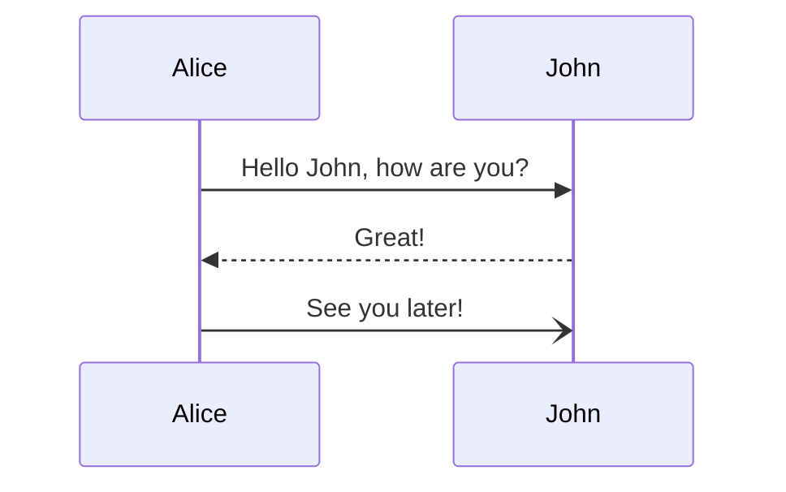
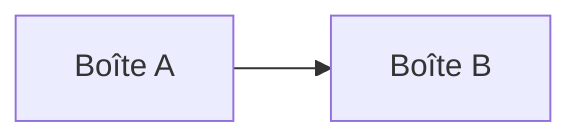
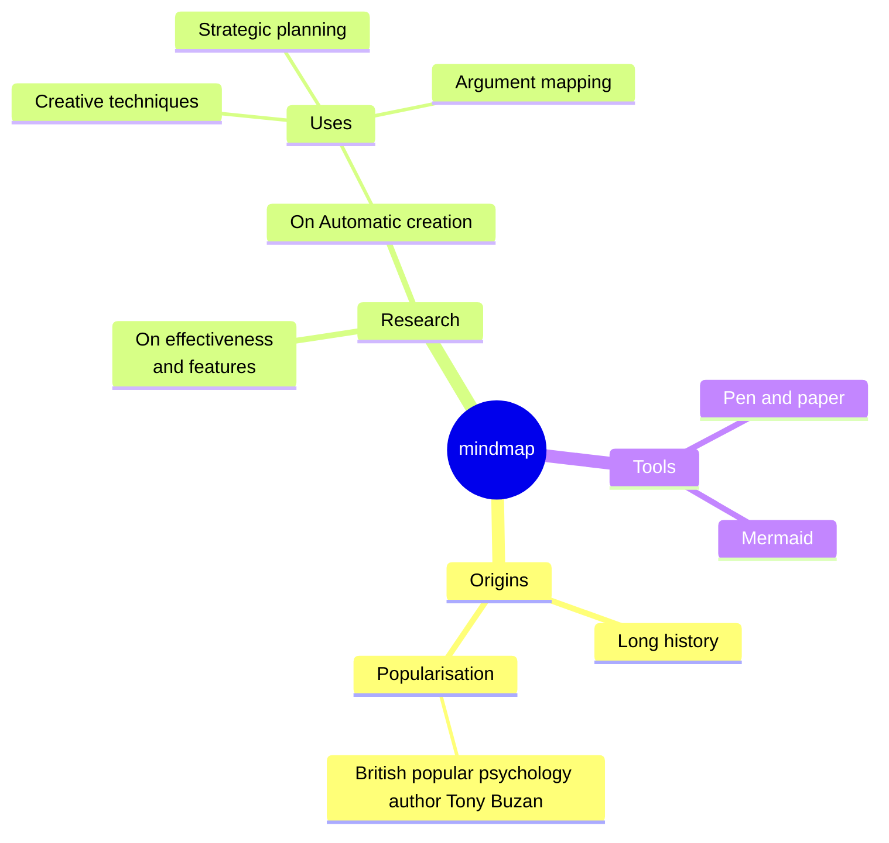
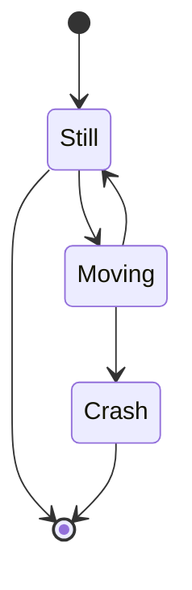

> J'aimerais observer des répertoires à partir du récursiveFileObserver et du TauFileObserver qui en est une implémentation. Et je voudrais savoir si, comme je l'ai créé, le TauFileObserver ne risque pas de louper des choses qui pourraient impacter l'affichage dans l'explorateur de fichiers. Donc l'explorateur de fichiers utilise quoi ? Il utilise bien sûr les fichiers et les dossiers qui se trouvent dans un dossier donné. Et pour chacun de ces fichiers, et pour l'ensemble des items du dossier, il utilise la date de modification. Pour les dossiers qui sont à l'intérieur du dossier parent, il regarde aussi des fois dans le fichier .folderSigma.html et c'est tout.

Oui : **dans ta config actuelle, `TauFileObserver` peut rater des signaux qui impactent l’affichage**, en particulier les changements de date de modification **sans écriture de contenu**, les renommages/suppressions de dossiers observés, et les surcharges de file d’attente.

Pourquoi ?

- Tu construis `TauFileObserver` avec un **mask restreint** : `MOVED_FROM | MOVED_TO | CREATE | DELETE | MODIFY` (et `MOVED_FROM` répété). Tu **n’inclus pas** `ATTRIB`, `DELETE_SELF`, `MOVE_SELF`, ni `CLOSE_WRITE`. Or :
    
    - **`ATTRIB`** couvre les changements d’attributs/fuse (dont **mtime** sans écriture). Si ton explorateur s’appuie sur `modificationDate`, tu peux **ne rien recevoir** quand seule la date change (ex. `setLastModified`, copie/restore de métadonnées, SAF qui ajuste mtime).
        
    - **`CLOSE_WRITE`** te permet de réagir **après** qu’un fichier ait fini d’être écrit (utile pour re-lister sans lire un fichier en cours d’écriture).
        
    - **`DELETE_SELF` / `MOVE_SELF`** sont essentiels pour **retirer les watchers** d’un dossier observé qui disparaît ou est déplacé ; sans eux tu gardes des watchers « fantômes » et tu cesses d’écouter le nouvel emplacement.
        
- Ton `RecursiveFileObserver` gère bien l’ajout/retrait dynamique de watchers **si l’évènement est livré**. Mais comme `TauFileObserver` **ne demande pas** `DELETE_SELF | MOVE_SELF`, la branche :
    
    ```kotlin
    val selfGone = (event and (DELETE_SELF or MOVE_SELF)) != 0
    if (selfGone) removeWatcher(dir)
    ```
    
    **ne s’exécutera jamais** (l’évènement ne vient pas). Idem pour `ATTRIB`.
    

### Ce qu’il faut ajouter pour coller à ton besoin (dates, fichiers, sous-dossiers, .folderSigma.html)

1. **Élargis le mask dans `TauFileObserver`** :
    

```kotlin
FileObserver.MOVED_FROM or
FileObserver.MOVED_TO   or
FileObserver.CREATE     or
FileObserver.DELETE     or
FileObserver.MODIFY     or
FileObserver.CLOSE_WRITE or    // fin d’écriture
FileObserver.ATTRIB      or    // mtime/attributs
FileObserver.DELETE_SELF  or    // le dossier observé disparaît
FileObserver.MOVE_SELF          // le dossier observé est renommé/déplacé
```

Ainsi, tu captes :

- la création/suppression/renommage d’items (pour re-lister le dossier),
    
- les **changements d’attributs/mtime** (clé pour l’affichage par date),
    
- la fin d’écriture (éviter de lire des fichiers incomplets),
    
- la disparition/déplacement d’un **dossier observé** (nettoyage et/ou re-attachement).
    

2. **Traite l’overflow** (rare mais critique). En cas de **`Q_OVERFLOW`**, fais une **re-scan** complet du sous-arbre du dossier concerné (c’est l’unique façon de se resynchroniser). Tu as déjà la constante et l’utilitaire `fileObserverFlagsToString` ; ajoute par ex. :
    

```kotlin
if ((event and 0x00004000) != 0) { // FO_Q_OVERFLOW
    // -> rescan(dir) et re-publie un snapshot propre vers ton UI
}
```

3. **Déduplication / coalescence**  
    Selon le volume, regroupe (par chemin) les évènements reçus pendant ~50–150 ms (debounce) avant de **re-lister** et d’émettre vers l’UI. Ça évite les tempêtes (CREATE→MODIFY→CLOSE_WRITE en rafale) et stabilise l’ordre d’affichage.
    
4. **Scope de coroutines**  
    Dans `TauFileObserver`, tu crées un **nouveau `CoroutineScope` par évènement** ; préfère **un scope unique** (membre), type :
    

```kotlin
private val scope = CoroutineScope(dispatcher + SupervisorJob())
// onEvent -> scope.launch { doOnEvent(event, path) }
```

Ça réduit les allocations et le risque de jobs orphelins si ça mitraille.

5. **Cas `.folderSigma.html`**  
    Avec le mask proposé, tu recevras **`MODIFY`/`CLOSE_WRITE`** quand le fichier est mis à jour et **`CREATE`/`DELETE`** s’il est créé/supprimé. Si ton UI lit ce fichier pour enrichir l’affichage des **dossiers enfants**, relance ton parsing sur ces évènements-là (idéalement coalescés).
    
6. **Si tu observes via SAF (URI) et non `File`**  
    `FileObserver` **ne voit pas** les changements sur un `DocumentFile` (provider). Dans ce cas, ajoute un **`ContentObserver`** sur l’URI racine sélectionné (ou mixe : `FileObserver` pour chemins fichiers => stockage « réel » + `ContentObserver` côté SAF). (Ton code actuel est `File`-based.)
    

---

### Patch minimal côté `TauFileObserver`

```kotlin
class TauFileObserver(
    val file: File,
    val doOnEvent: suspend (event: Int, path: TauPath?) -> Unit
) : RecursiveFileObserver(
    file,
    FileObserver.MOVED_FROM or
    FileObserver.MOVED_TO   or
    FileObserver.CREATE     or
    FileObserver.DELETE     or
    FileObserver.MODIFY     or
    FileObserver.CLOSE_WRITE or
    FileObserver.ATTRIB      or
    FileObserver.DELETE_SELF  or
    FileObserver.MOVE_SELF,
    { evt ->
        val path = TauPath.of(evt.absolute.absolutePath)
        // scope unique, pas à chaque event
        observerScope.launch { doOnEvent(evt.event, path) }
    }
) {
    private val observerScope = CoroutineScope(Dispatchers.IO + SupervisorJob())
}
```

Et dans `RecursiveFileObserver.onEvent`, si `(event & FO_Q_OVERFLOW) != 0`, **re-scan** du dossier `dir` (et réconcilie l’état UI).

---

### TL;DR

- **Ajoute `ATTRIB`, `CLOSE_WRITE`, `DELETE_SELF`, `MOVE_SELF`** à ton mask.
    
- **Traite `Q_OVERFLOW`** en re-scannant.
    
- **Scope unique** pour dispatcher les callbacks.
    
- Tu éviteras ainsi de rater des changements de **date de modification**, des **renommages/suppressions** de dossiers observés, et les fins d’écriture — tout ce qui conditionne l’actualisation fidèle de ton explorateur.


[Treemap Diagram Syntax | Mermaid](https://mermaid.js.org/syntax/treemap.html)











